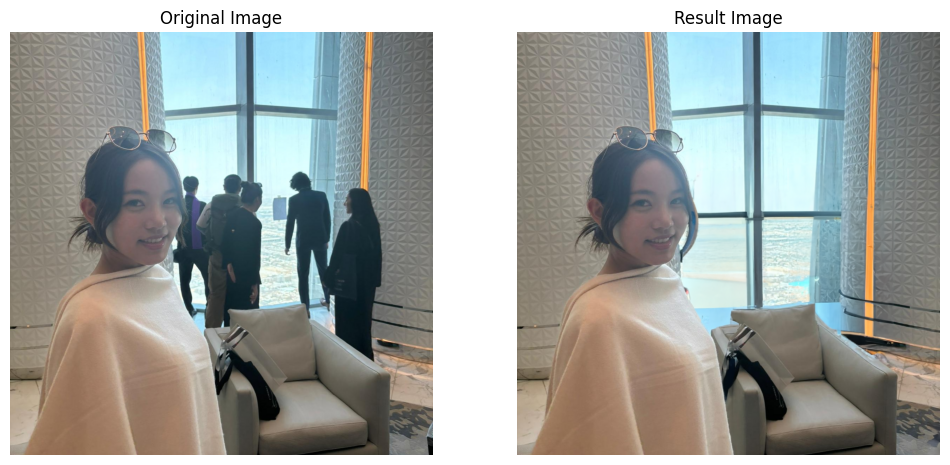
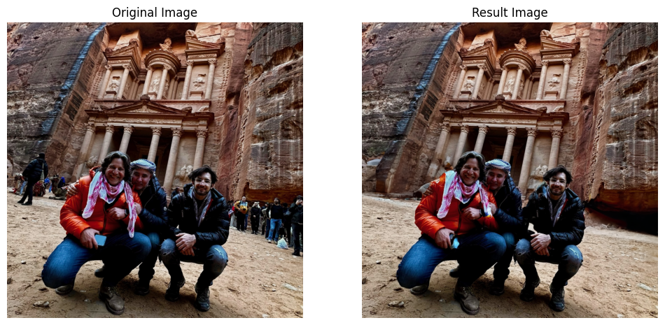

# Remove People

Proof-of-concept for removing unwanted people and objects from images.


<center style="font-size: 10px;">Example 1 of the Remove People notebook results.</center>


<center style="font-size: 10px;">Example 2 of the Remove People notebook results.</center>

This feature is available in the main photo apps ([Apple](https://x.com/0xashesonchain/status/1800273077164523697) and [Google](https://www.youtube.com/watch?v=tEj5lFJyNTo)), but thought it would be cool to recreate the functionality from scratch using existing over-the-counter AI solutions.

This is how object removal works in this implementation:

1. Detect objects in the image using a [Mask R-CNN](https://arxiv.org/abs/1703.06870) model with default weights from [`pytorch`](https://pytorch.org/vision/main/models/generated/torchvision.models.detection.maskrcnn_resnet50_fpn.html). The model was pre-trained using the [COCO dataset](https://cocodataset.org/).
2. Manually select the objects in the image that you want to keep.
3. Remove the objects that you don't want and create a PNG without them.
4. Use the OpenAI API to generate clean background pixels without this objects.

Originally I tried using existing cloud solutions for the object detection, but their results were bounding boxes without the exact contours of the objects. This is why I decided to use a local model and it proved to be a better solution. The results given by cloud providers are available in the [Cloud Examples](cloud_examples.ipynb) notebook, but they are nothing special.

## Environment Setup

Create and activate a Python 3.9 virtual environment:

```shell
python3.9 -m venv ~/venvs/removepeople
source ~/venvs/removepeople/bin/activate
```

Install the required dependencies and create a Jupyter kernel named `removepeople`:

```shell
./cmd/install.sh
```

To clean up resources, run:

```shell
jupyter kernelspec uninstall removepeople
deactivate
rm -rf ~/venvs/removepeople
```

Set up the OpenAI API key in a `.env` file:

```shell
echo "OPENAI_API=your_api_key" > .env
```

## Brief Code Explanation

This project includes two Jupyter notebooks.

| | Description |
| --- | --- |
| [Remove People](remove_people.ipynb) | Main notebook for removing unwanted people and objects from images. |
| [Cloud Examples](cloud_examples.ipynb) | Examples of object detection with cloud providers. Requires local `aws` credentials and a `service-account.json` file for GCP. (Additional dependencies: `pip install boto3 google-cloud-vision`). |

### Running Notebooks

1. Finish the [environment setup](#Environment-Setup) as explained in this file.
2. Open file in Jupyter.
3. Connect to the `removepeople` kernel.
4. Execute the cells, adding your own images.

To add images, place them in the `images/original` folder and set the `image_name` variable in the first code cell of the notebook.
